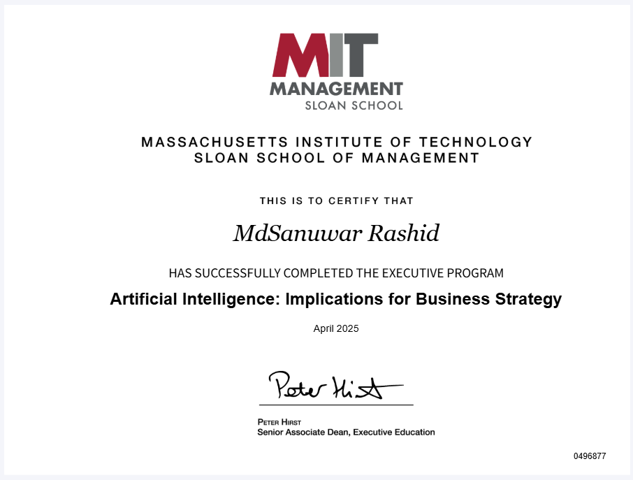

# MIT Sloan + CSAIL: Artificial Intelligence - Implications for Business Strategy

## Executive Program Completion Certificate

---

## Program Overview

**Institution:** Massachusetts Institute of Technology - Sloan School of Management  
**Program:** Artificial Intelligence: Implications for Business Strategy  
**Completion Date:** April 2025  
**Certificate Holder:** Sanuwar Rashid  
**Certificate ID:** 0496877

---

## Program Highlights

This comprehensive executive program, jointly offered by **MIT Sloan** and **MIT CSAIL**, provided strategic insights into artificial intelligence applications for business transformation. The program covered six critical modules:

### 🎯 Module 1: Building Strategic Differentiation with AI
- Strategic alignment of AI with Porter's Generic Strategies
- Strengthening organizational identity through AI
- Strategic fit vs. organizational dilution

### 🤖 Module 2: Machine Learning for Practical Business Solutions
- Supervised, Unsupervised, and Reinforcement Learning
- Practical ML implementation strategies
- Bias-variance tradeoff and model lifecycle management

### 🚀 Module 3: Unlocking the Power of Generative AI
- Foundation Models and their business applications
- Zero-shot and few-shot learning capabilities
- Ethical considerations in Generative AI deployment

### 🤖 Module 4: Robotics, RPA, and Intelligent Automation
- Physical AI and robotic process automation
- Digital workforce transformation
- Human-machine collaboration frameworks

### ⚖️ Module 5: Ethical AI and the Future of Work
- Core ethical principles in AI deployment
- Future of work: disruption vs. augmentation
- Building trust through responsible AI practices

### 🗺️ Module 6: Building a Strategic AI Roadmap
- Enterprise-wide AI strategy development
- Human + Machine collective intelligence
- Organizational transformation through AI

---

## Key Learning Outcomes

Through this program, I gained expertise in:

- **Strategic AI Alignment:** Connecting AI initiatives to core business strategy and competitive positioning
- **Technical Foundation:** Understanding ML algorithms, foundation models, and automation technologies
- **Ethical Leadership:** Implementing responsible AI practices with focus on fairness, transparency, and accountability
- **Organizational Change:** Managing AI-driven transformation while maintaining human-centric values
- **Future Readiness:** Preparing organizations for emerging AI paradigms and workforce evolution

---

## Practical Application: AtoZ Pharmacy Case Study

Throughout the program, I developed a comprehensive AI transformation strategy for a fictional hospice-focused pharmacy chain, demonstrating:

- **Predictive Analytics** for logistics optimization
- **Generative AI** for multilingual customer support
- **RPA Implementation** for billing and compliance automation
- **Ethical AI Framework** for vulnerable patient populations
- **Strategic Roadmap** for phased AI adoption

---

## Personal Transformation

This program fundamentally shifted my perspective from viewing AI as mere "automation tools" to understanding AI as **strategic levers** for organizational differentiation and human augmentation.

### Key Mindset Shifts:
✅ **From:** Technical solutions focus  
**To:** Business-aligned transformations

✅ **From:** AI adoption in isolation  
**To:** AI embedded in organizational DNA

✅ **From:** Replacement mindset  
**To:** Human-AI collaboration

---

## Professional Impact

This certification enhances my ability to:

- Lead AI initiatives that align with business strategy
- Design ethical AI frameworks for healthcare and regulated industries
- Build bridges between technical teams and business stakeholders
- Drive organizational change through responsible AI adoption

---

## Future Vision

*"AI is not a technical project. It's a leadership challenge. The organizations that thrive in the AI era will not be the ones with the most algorithms — but the ones with the clearest vision, strongest ethics, and the deepest commitment to human progress."*

---

## Extended Learning Journey

For a detailed exploration of my learning journey through this program, including practical applications, case studies, and strategic insights, read my comprehensive reflection:

**📖 [From Curiosity to Strategy: My Strategic Evolution Through MIT Sloan + CSAIL AI Learning](https://www.linkedin.com/pulse/from-curiosity-strategy-my-strategic-evolution-through-sanuwar-rashid-ezdse/?trackingId=za6aoxg3m7TsdwdDvhuwpg%3D%3D)**

This article provides in-depth analysis of each module, practical applications, and strategic insights gained throughout the program.

---

## Program Credentials

**Issued by:** Peter Hirst, Senior Associate Dean, Executive Education  
**Institution:** Massachusetts Institute of Technology, Sloan School of Management  
**Verification:** Certificate ID 0496877

---

*This certificate represents a commitment to ethical AI leadership and strategic thinking in the age of artificial intelligence.*